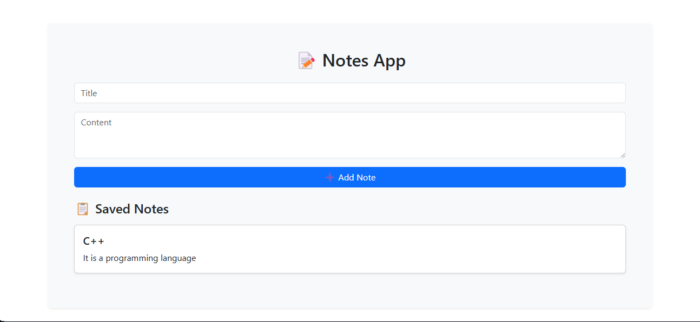

# Noted. | MERN Notes App

A focused, full-stack notebook for capturing ideas and keeping important notes within reach. Create notes, pin the ones you want at the top, and keep everything backed by MongoDB.


## Explore

- [Features](#features)
- [Getting started](#getting-started)
- [API reference](#api-reference)
- [Project structure](#project-structure)
- [Screenshot](#screenshot)
- [Contributing](#contributing)

## Features

- **Write notes:** Save a title and content to your notebook.
- **Pin what matters:** Use the pin control on a note to move it into the **Pinned** section above all other notes. Pin state is saved in MongoDB.
- **Responsive workspace:** Add and browse notes on desktop or mobile.
- **REST API:** React communicates with an Express API backed by MongoDB and Mongoose.

<details>
<summary>How pinning works</summary>

Each note has a `pinned` boolean. Select **Pin** to save it as pinned; select **Pinned** to return it to **All notes**. Refreshing the page keeps the selection.

</details>

## Tech stack

| Layer | Tools |
| --- | --- |
| Frontend | React, Axios, CSS |
| Backend | Node.js, Express |
| Database | MongoDB, Mongoose |

## Getting started

### Prerequisites

- Node.js and npm
- MongoDB running locally, or a MongoDB connection string

### 1. Configure the backend

```bash
cd backend
npm install
```

Create `backend/.env` with your MongoDB connection string:

```env
PORT=5000
MONGO_URI=mongodb://127.0.0.1:27017/notes_app
```

Start the API:

```bash
npx nodemon server.js
```

The API listens at `http://localhost:5000`.

### 2. Start the frontend

In a second terminal, from the repository root:

```bash
cd frontend
npm install
npm start
```

The development app opens at `http://localhost:3000` and sends API requests to `http://localhost:5000`.

## API reference

All note endpoints are under `/api/notes`.

| Method | Endpoint | Description | Request body |
| --- | --- | --- | --- |
| `GET` | `/api/notes` | List saved notes | — |
| `POST` | `/api/notes` | Create a note | `{ "title": "...", "content": "..." }` |
| `PATCH` | `/api/notes/:id/pin` | Update a note's pinned state | `{ "pinned": true }` |

Notes include `title`, `content`, `pinned`, and Mongoose `createdAt` / `updatedAt` timestamps. New notes start unpinned.

## Project structure

```text
Notes_App/
├── backend/
│   ├── models/Note.js
│   ├── routes/notes.js
│   └── server.js
├── frontend/
│   ├── public/
│   └── src/
│       ├── App.js
│       ├── App.css
│       └── index.js
└── screenshot/
```

## Screenshot



## Contributing

Contributions are welcome. Fork the repository, create a feature branch, make your changes, and open a pull request.

## Contact

[GitHub profile](https://github.com/Rishmo)

